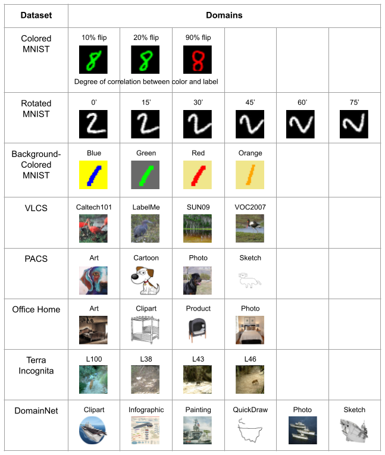

# meta-Domain Specific-Domain Invariant (mDSDI)
Repository for the ICML21 submission: "Exploiting Domain-Specific Features to Enhance Domain Generalization".


## Guideline
### To prepare:
Install prerequisite packages:
```sh
python -m pip install -r requirements.txt
```

Download, unzip the datasets and pretrained models:
```sh
bash setup.sh
```


### To train model:
Train 5 times:
```sh
for i in {1..5}; do
     taskset -c `<cpu_index>` python main.py --config `<config_path>` --exp_idx $i --gpu_idx `<gpu_index>`
done
```
where the parameters are the following:
- `<cpu_index>`: CPU index.
- `<config_path>`: Path store configuration hyper-parameters. Example (target: art in PACS): `<config_path>` = "algorithms/mDSDI/configs/PACS_art.json".
- `<gpu_index>`: CPU index.

Select different settings by editing in /configs/..json, logging results are stored in /results/logs//.

### To visualize objective functions:

```sh
tensorboard --logdir=/mnt/vinai/mDSDI/algorithms/DSDI/results/tensorboards/PACS_photo_1
```


### To plot t-SNE:

```sh
python utils/tSNE_plot.py
```
