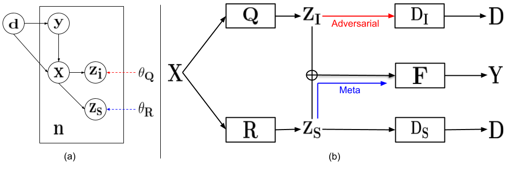

# meta-Domain Specific-Domain Invariant (mDSDI)


## Guideline
### To prepare: (download, unzip the datasets and pretrained models)

```sh
#Download pretrained models
wget --load-cookies /tmp/cookies.txt "https://docs.google.com/uc?export=download&confirm=$(wget --quiet --save-cookies /tmp/cookies.txt --keep-session-cookies --no-check-certificate 'https://docs.google.com/uc?export=download&id=1bDey1GKP528wWfuLqGev5RBIUbHPoOxO' -O- | sed -rn 's/.*confirm=([0-9A-Za-z_]+).*/\1\n/p')&id=1bDey1GKP528wWfuLqGev5RBIUbHPoOxO" -O pretrained_models.zip && rm -rf /tmp/cookies.txt
unzip pretrained_models.zip
rm -rf pretrained_models.zip
#Download the datasets
wget --load-cookies /tmp/cookies.txt "https://docs.google.com/uc?export=download&confirm=$(wget --quiet --save-cookies /tmp/cookies.txt --keep-session-cookies --no-check-certificate 'https://docs.google.com/uc?export=download&id=1W_6aYi_DR_02j0Z01LsL1rCe7OS5B0pE' -O- | sed -rn 's/.*confirm=([0-9A-Za-z_]+).*/\1\n/p')&id=1W_6aYi_DR_02j0Z01LsL1rCe7OS5B0pE" -O data.zip && rm -rf /tmp/cookies.txt
unzip data.zip
rm -rf data.zip
cd data/DomainNet/Raw\ images/

#Download DomainNet dataset
wget --load-cookies /tmp/cookies.txt "https://docs.google.com/uc?export=download&confirm=$(wget --quiet --save-cookies /tmp/cookies.txt --keep-session-cookies --no-check-certificate 'https://docs.google.com/uc?export=download&id=1fpD2L6lsejDD3rWLOGeqnlt5pplZEYR5' -O- | sed -rn 's/.*confirm=([0-9A-Za-z_]+).*/\1\n/p')&id=1fpD2L6lsejDD3rWLOGeqnlt5pplZEYR5" -O clipart.zip && rm -rf /tmp/cookies.txt
unzip clipart.zip
rm -rf clipart.zip
wget --load-cookies /tmp/cookies.txt "https://docs.google.com/uc?export=download&confirm=$(wget --quiet --save-cookies /tmp/cookies.txt --keep-session-cookies --no-check-certificate 'https://docs.google.com/uc?export=download&id=1ypzUY4BHfTz4EnPk6JwwTYQPGpHdV0Ts' -O- | sed -rn 's/.*confirm=([0-9A-Za-z_]+).*/\1\n/p')&id=1ypzUY4BHfTz4EnPk6JwwTYQPGpHdV0Ts" -O infograph.zip && rm -rf /tmp/cookies.txt
unzip infograph.zip
rm -rf infograph.zip
wget --load-cookies /tmp/cookies.txt "https://docs.google.com/uc?export=download&confirm=$(wget --quiet --save-cookies /tmp/cookies.txt --keep-session-cookies --no-check-certificate 'https://docs.google.com/uc?export=download&id=1CtQHgDoh5-IDbhTDMni8cGZq8_MR1tCB' -O- | sed -rn 's/.*confirm=([0-9A-Za-z_]+).*/\1\n/p')&id=1CtQHgDoh5-IDbhTDMni8cGZq8_MR1tCB" -O sketch.zip && rm -rf /tmp/cookies.txt
unzip sketch.zip
rm -rf sketch.zip
wget --load-cookies /tmp/cookies.txt "https://docs.google.com/uc?export=download&confirm=$(wget --quiet --save-cookies /tmp/cookies.txt --keep-session-cookies --no-check-certificate 'https://docs.google.com/uc?export=download&id=1SKHTWUm2KPIOx0y4yKycue33KER6SZIs' -O- | sed -rn 's/.*confirm=([0-9A-Za-z_]+).*/\1\n/p')&id=1SKHTWUm2KPIOx0y4yKycue33KER6SZIs" -O real.zip && rm -rf /tmp/cookies.txt
unzip real.zip
rm -rf real.zip
wget --load-cookies /tmp/cookies.txt "https://docs.google.com/uc?export=download&confirm=$(wget --quiet --save-cookies /tmp/cookies.txt --keep-session-cookies --no-check-certificate 'https://docs.google.com/uc?export=download&id=1SaOPwlELYDneXZTbC31cDIMmL0AeZqiy' -O- | sed -rn 's/.*confirm=([0-9A-Za-z_]+).*/\1\n/p')&id=1SaOPwlELYDneXZTbC31cDIMmL0AeZqiy" -O quickdraw.zip && rm -rf /tmp/cookies.txt
unzip quickdraw.zip
rm -rf quickdraw.zip
wget --load-cookies /tmp/cookies.txt "https://docs.google.com/uc?export=download&confirm=$(wget --quiet --save-cookies /tmp/cookies.txt --keep-session-cookies --no-check-certificate 'https://docs.google.com/uc?export=download&id=17tYsUVzf3S8kwEp4GXrKRZHYGIhTkOV8' -O- | sed -rn 's/.*confirm=([0-9A-Za-z_]+).*/\1\n/p')&id=17tYsUVzf3S8kwEp4GXrKRZHYGIhTkOV8" -O painting.zip && rm -rf /tmp/cookies.txt
unzip painting.zip
rm -rf painting.zip
```
{:height="50%" width="50%"}

### To train model: (select different settings by editing in /configs/..json, results are stored in /results/logs/)

```sh
for i in {1..5}; do
     taskset -c "0" python main.py --config "algorithms/mDSDI/configs/PACS_art.json" --exp_idx $i --gpu_idx "0"
done
```

### To visualize objective functions: ()

```sh
tensorboard --logdir=/mnt/vinai/mDSDI/algorithms/DSDI/results/tensorboards/PACS_photo_1
```
{:height="50%" width="50%"}

### To plot t-SNE: ()

```sh
python utils/tSNE_plot.py
```
